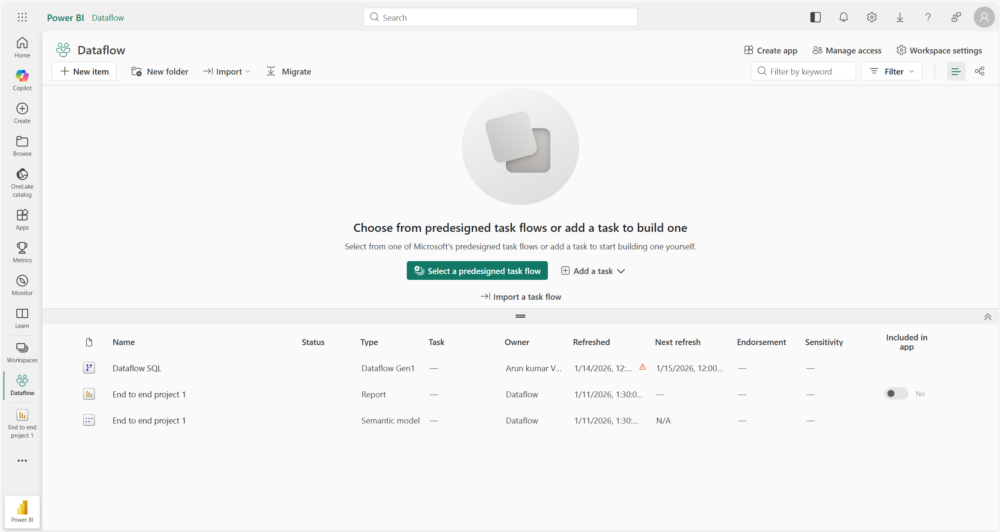
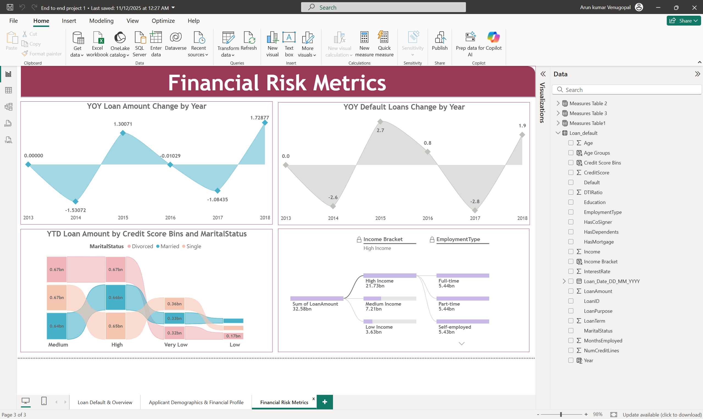

# Loan Default Analysis - End to End Power BI Project (SQL Server + Dataflow + Power BI Service)

### 📂 GitHub Repository
https://github.com/Arun-Kumar-Venugopal/Loan-Default-Analysis-PowerBI

## Business Context
This dashboard supports **credit risk and lending teams** by analyzing loan default patterns.
It helps identify **high-risk customers**, monitor **default rates**, and evaluate loan portfolio health to support better credit decision-making.

## Architecture
SQL Server → Power BI Service Dataflow → Power BI Desktop → Power BI Service

## Key Highlights
- Designed an end-to-end Power BI solution using SQL Server and Dataflows
- Implemented DAX measures for YOY, YTD, and risk segmentation
- Built a 3-page analytical dashboard for loan default analysis

## Problem Statement

This dashboard helps stakeholders understand **loan performance and default risk** using borrower demographics, credit profile, and time-based risk metrics.  
It provides insights into:

- Which **loan purposes** contribute most to total loan amount  
- How **income and default rate** vary by employment type  
- How **default rate changes over years**  
- How **loan amount patterns** differ by credit score bins, age groups, marital status, education, mortgage/dependent status  
- How **YOY and YTD** metrics highlight risk trends over time  

The report is built as an end-to-end pipeline:
**SQL Server → Power BI Service Dataflow → Power BI Desktop → Power BI Service (Publish + Refresh).**

---

## Steps followed

### 1) Data Source Setup (SQL Server)
- Step 1 : Installed **Microsoft SQL Server Developer Edition** and **SSMS**.
- Step 2 : Created database `Loan`.
- Step 3 : Imported the dataset table into SQL Server (table name: `Loan_default`).

### 2) Power BI Gateway Setup
- Step 4 : Installed and configured **On-premises data gateway (Standard mode)**.
- Step 5 : Verified gateway connectivity between Power BI Service and SQL Server.

### 3) Dataflow Creation (Power BI Service)
- Step 6 : Created a workspace for the project.
- Step 7 : Created **Dataflow (Gen1)** and connected it to SQL Server:
  - Server: `REYAN`
  - Database: `Loan`
  - Table: `Loan_default`
- Step 8 : Refreshed the Dataflow successfully and confirmed data load.

### 4) Power BI Desktop Report Development
- Step 9 : Connected Power BI Desktop to **Power BI Dataflow** and loaded `Loan_default`.
- Step 10 : In Power Query, enabled:
  - Column quality
  - Column distribution
  - Column profile
  - Column profiling based on **entire dataset**
- Step 11 : Verified data types (especially `Loan_Date_DD_MM_YYYY` as Date).

### 5) Calculated Columns Created (DAX)
- Step 12 : Created calculated columns in `Loan_default`:
  - `Year`
  - `Age Groups`
  - `Credit Score Bins`
  - `Income Bracket`

### 6) Measures Tables Created (DAX Organization)
- Step 13 : Created 3 measures tables:
  - `Measures Table 1`
  - `Measures Table 2`
  - `Measures Table 3`
- Step 14 : Added measures into these tables for clean model organization.

### 7) Report Pages Built (3 Pages)
- Step 15 : Created **Page 1: Loan Default & Overview**
  - Loan Amount by Purpose
  - Average Income by Employment Type
  - Default Rate (%) by Employment Type
  - Average Loan Amount by Age Group
  - Default Rate (%) by Year

- Step 16 : Created **Page 2: Applicant Demographics & Financial Profile**
  - Median Loan Amount by Credit Score Category
  - Average Loan Amount (High Credit) by Age Groups & Marital Status (Donut)
  - Total Loan (Adults) by Credit Score Bins
  - Total Loan (Middle Age Adults) by Mortgage/Dependents
  - Number of Loans by Education Type

- Step 17 : Created **Page 3: Financial Risk Metrics**
  - YOY Loan Amount Change by Year
  - YOY Default Loans Change by Year
  - YTD Loan Amount by Credit Score Bins & Marital Status
  - Decomposition Tree using Income Bracket → Employment Type

### 8) Publish to Power BI Service + Refresh
- Step 18 : Published the report from Power BI Desktop to Power BI Service.
- Step 19 : Configured **schedule refresh** for the semantic model (dataset).
- Step 20 : Configured **schedule refresh** (and incremental refresh if enabled) for the Dataflow.

---

## Data Model (Table & Key Fields)

### Table : `Loan_default`
**Main columns used**
- LoanID, Age, Income, LoanAmount, CreditScore, EmploymentType, Education, MaritalStatus  
- HasMortgage, HasDependents, LoanPurpose, Default  
- Loan_Date_DD_MM_YYYY, Year  
- Age Groups, Credit Score Bins, Income Bracket  

---

## DAX Measures Used (Summary)

### Measures Table1
- Loan Amount by Purpose
- Average Income by Employment Type
- Default Rate by Employment Type
- Average Loan by Age Group
- Default Rate by Year

### Measures Table 2
- Median by Credit Score bins
- Average Loan Amount (High Credit)
- Total Loan (Credit Bins)
- Total Loan (Middle Age Adults)
- Loans by Education Type
- high income borrower rate

### Measures Table 3
- YOY Loan Amount Change
- YOY Default Loans Change
- YTD Loan Amount

---
# Snapshot of Dashboard (Power BI Service)

The report, semantic model, and dataflow were published to **Power BI Service** from Power BI Desktop as part of the end-to-end pipeline.

> **Note:**  
> This project was developed and published using a **Power BI Pro free trial**.  
> After the trial expired, **dataflow refresh is disabled** because incremental refresh requires **Premium capacity**.  
> However, the deployment workflow (SQL Server → Dataflow → Dataset → Report) was completed successfully.

# Report Snapshot (Power BI Desktop)
All report visuals and pages shown below are captured from **Power BI Desktop**, 
which was used for **data modeling, DAX development, and report design** 
before publishing to Power BI Service.

### Page 1: Loan Default & Overview

This page provides a high-level overview of loan distribution, borrower income, and default trends.

### Page 2: Applicant Demographics & Financial Profile

This page analyzes borrower demographics and financial characteristics across age groups, credit scores, education, and marital status.

### Page 3: Financial Risk Metrics

This page focuses on time-based risk analysis using YOY, YTD, and decomposition-based insights.

# Insights

A three-page analytical report was created in Power BI Desktop and published to Power BI Service.

Key insights derived from the dashboard include:

- Loan amounts vary significantly by **loan purpose**, highlighting dominant loan categories.
- **Employment type** impacts both average income levels and default rates.
- **Default rate by year** reveals fluctuations in credit risk over time.
- **Credit score segmentation** helps identify differences in loan distribution and borrower risk.
- **YOY and YTD metrics** provide visibility into changes in loan disbursement and default behavior.
- The **decomposition tree** enables drill-down analysis of total loan amount by income bracket and employment type.

## Tools & Technologies
- Microsoft SQL Server & SSMS  
- Power BI Service (Dataflow Gen1)  
- On-Premises Data Gateway (Standard Mode)  
- Power BI Desktop (DAX & Visualizations)  
- Power BI Service (Publish, Refresh & Sharing)

> Note: Power BI Service link requires Microsoft login.
> Dataset refresh depends on workspace capacity.
### ▶️ Live Demo (Power BI Service)
🔗 View-only report (Microsoft login required):  
https://app.powerbi.com/links/2HxydxvEaj?ctid=4b05e781-4500-43c7-a12b-f7a45bcd4a54&pbi_source=linkShare

## What I Learned
- Building an end-to-end Power BI solution using SQL Server, Dataflows, and Power BI Service
- Configuring and using the on-premises data gateway for scheduled refresh
- Designing a star-schema data model for loan and customer analytics
- Developing DAX measures for default rates, risk segmentation, and time-based analysis
- Publishing and managing datasets and reports in Power BI Service
- Understanding Power BI licensing limitations (Pro vs Premium) for dataflows and refresh
- Documenting enterprise-style BI projects for portfolio and stakeholder review

## Author
Created by: Arun Kumar Venugopal
